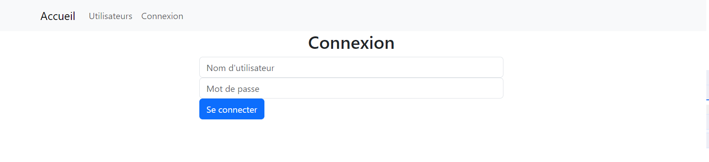
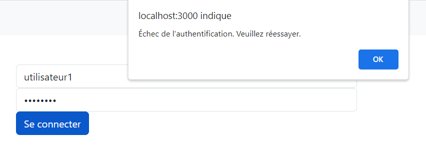
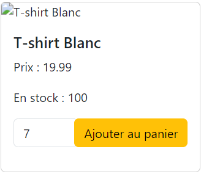
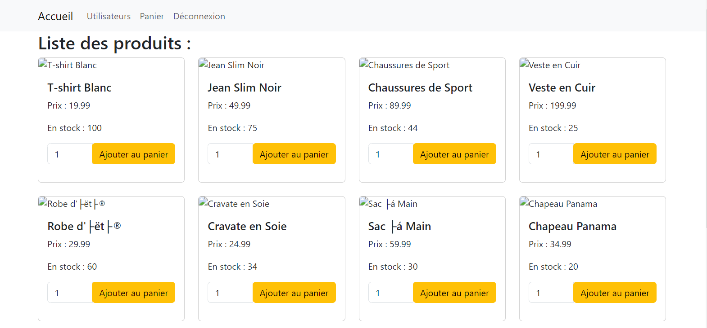
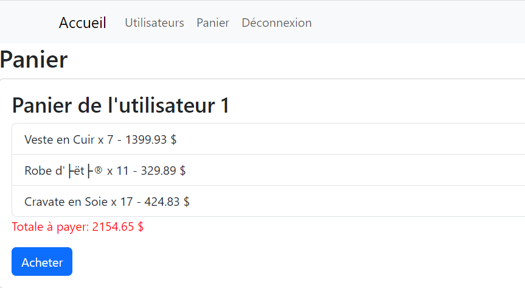
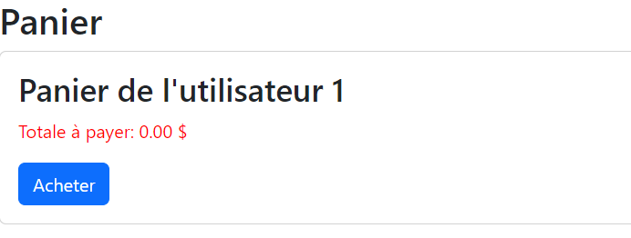

# Rapport sur le Test Technique - Création d'une Application de Paiement

Je tiens à vous remercier pour l'opportunité que vous m'avez donnée de participer au test technique pour le poste de Fullstack Developer en alternance chez The Bradery. Je suis ravi de partager avec vous le travail que j'ai accompli dans le cadre de ce test.

## Objectif
L'objectif du test était de créer une petite application de paiement en utilisant les technologies suivantes :

- **Frontend** : J'ai choisi d'utiliser React pour développer l'interface utilisateur. J'ai créé une interface conviviale et intuitive qui permet aux utilisateurs de naviguer facilement dans l'application.

- **Backend** : J'ai développé une API en utilisant GraphQL avec Node.js et Express.js. Cette API gère toutes les fonctionnalités nécessaires pour le processus de paiement, y compris la gestion du panier et des commandes.

- **Base de données** : J'ai reçu un script MySQL pour créer une table de produits. En plus de cela, j'ai créé toutes les autres tables nécessaires pour stocker les informations sur les utilisateurs, les commandes et les détails des produits.

## Fonctionnalités
J'ai implémenté les fonctionnalités suivantes dans l'application :

1. **Panier** : Les utilisateurs peuvent ajouter des produits à leur panier en respectant la limite de stock disponible. J'ai mis en place des vérifications pour s'assurer que les utilisateurs ne peuvent pas ajouter plus de produits qu'il n'y en a en stock.

2. **Page de Paiement** : Une fois les produits ajoutés au panier, les utilisateurs peuvent se diriger vers une page de paiement où ils peuvent finaliser la commande.

3. **Commandes** : Après avoir passé une commande, une entrée est automatiquement créée dans la base de données, enregistrant le prix total de la commande ainsi que les détails de chaque article de la commande. De plus, le stock de produits est mis à jour pour refléter les produits achetés.


# Documentation du Code - Frontend (App.js)

## Introduction
Le fichier `App.js` représente le point d'entrée de l'application frontend de notre système de paiement. Cette section de la documentation explique les principales fonctionnalités de `App.js` sans inclure le code source détaillé.

## Fonctionnalités Principales

1. **Authentification** : `App.js` gère l'authentification des utilisateurs en vérifiant leur statut d'authentification au chargement de la page. Il fait appel à une API backend pour cette vérification et met à jour l'état d'authentification en conséquence.


2. **Navigation** : L'application utilise React Router pour gérer la navigation entre les différentes pages. Les utilisateurs peuvent accéder à la liste des produits, à la liste des utilisateurs, au panier et à la page de connexion à partir de la barre de navigation.

3. **Gestion du Panier** : Lorsqu'un utilisateur est authentifié, il peut accéder à la page du panier où il peut visualiser les produits ajoutés au panier. Les produits sont gérés et stockés dans le panier jusqu'à ce que l'utilisateur finalise sa commande.

4. **Déconnexion** : L'application permet aux utilisateurs authentifiés de se déconnecter en cliquant sur le bouton de déconnexion. Cela révoque leur authentification et les ramène à la page de connexion.

5. **Page d'Accueil Dynamique** : En fonction de l'état d'authentification de l'utilisateur, la page d'accueil affiche soit la liste des produits, soit redirige l'utilisateur vers la page de connexion s'il n'est pas authentifié.


# Documentation du Code - Frontend (Login.js)

## Introduction
Le fichier `Login.js` est un composant essentiel de l'application frontend qui gère le processus d'authentification des utilisateurs. Cette section de la documentation explique les principales fonctionnalités de `Login.js` sans inclure le code source détaillé.

## Fonctionnalités Principales

1. **Formulaire de Connexion** : Le composant `Login.js` affiche un formulaire de connexion qui permet aux utilisateurs de saisir leur nom d'utilisateur et leur mot de passe.

<div align="center">
  
  <p style="text-align: center;">Image de l'authentification utilisateur</p>
</div>


2. **Gestion de l'Authentification** : Lorsque l'utilisateur soumet le formulaire, le composant envoie une requête POST à l'API backend avec les informations d'authentification. Si l'authentification est réussie (statut 200), il met à jour l'état d'authentification dans le composant parent (généralement `App.js`) en utilisant la fonction `setIsAuthenticated` passée en tant que prop.

3. **Redirection après l'Authentification** : Après une authentification réussie, l'utilisateur est redirigé vers la page d'accueil de l'application en utilisant le routeur de navigation.

4. **Gestion des Erreurs** : Le composant `Login.js` gère également les erreurs potentielles en cas d'échec de l'authentification ou en cas d'erreur lors de la requête vers l'API backend. Il affiche des messages d'erreur appropriés à l'utilisateur en cas de problème.

<div align="center">
  
  <p style="text-align: center;"></p>
</div>

5. **Saisie Contrôlée** : Les champs de saisie du nom d'utilisateur et du mot de passe sont des champs de saisie contrôlée, ce qui signifie que leur valeur est gérée par l'état du composant et mise à jour en fonction des modifications de l'utilisateur.

# Documentation du Code - Frontend (Product.js)

## Introduction
Le fichier `Product.js` représente un composant de l'application frontend qui permet aux utilisateurs de voir les détails d'un produit, de spécifier la quantité souhaitée et d'ajouter le produit au panier. Cette section de la documentation explique les principales fonctionnalités de `Product.js` sans inclure le code source détaillé.

## Fonctionnalités Principales

1. **Affichage des Détails du Produit** : Le composant `Product.js` affiche les détails du produit, y compris le nom du produit, le prix, la disponibilité en stock et une image représentative.

2. **Saisie de la Quantité** : Les utilisateurs peuvent spécifier la quantité du produit qu'ils souhaitent ajouter au panier en utilisant un champ de saisie numérique.


<div align="center">
  
  <p style="text-align: center;"></p>
</div>


3. **Ajout au Panier** : Lorsque l'utilisateur appuie sur le bouton "Ajouter au panier", le composant envoie une requête GraphQL au serveur backend pour ajouter le produit au panier. Il gère également l'affichage d'une alerte pour indiquer que le produit a été ajouté avec succès.

4. **Gestion des Erreurs** : Le composant `Product.js` gère les erreurs potentielles qui pourraient survenir lors de l'ajout du produit au panier, par exemple en cas de rupture de stock ou de problème de communication avec le serveur.

5. **Alerte de Confirmation** : Une fois que le produit a été ajouté au panier avec succès, une alerte de confirmation est affichée pour informer l'utilisateur que l'opération a réussi.


# Documentation du Code - Frontend (ProductList.js)

## Introduction
Le fichier `ProductList.js` représente un composant de l'application frontend qui affiche une liste de produits disponibles. Cette section de la documentation explique les principales fonctionnalités de `ProductList.js` sans inclure le code source détaillé.

## Fonctionnalités Principales

1. **Chargement des Produits** : Le composant `ProductList.js` effectue une requête GraphQL au serveur backend pour récupérer la liste des produits disponibles.

2. **Gestion du Chargement** : Pendant le chargement des données, le composant affiche un message "Chargement en cours..." pour informer l'utilisateur de l'attente.

3. **Gestion des Erreurs** : En cas d'erreur lors de la récupération des données depuis le serveur, le composant affiche un message d'erreur avec une description de l'erreur.

4. **Affichage des Produits** : Une fois les données récupérées avec succès, le composant affiche la liste des produits sous forme de cartes. Chaque carte représente un produit et inclut des détails tels que le nom, le prix, et la disponibilité en stock.

5. **Utilisation du Composant Product** : Le composant `ProductList.js` utilise le composant `Product` pour afficher chaque produit de manière répétée.

<div align="center">
  
  <p style="text-align: center;"></p>
</div>

# Documentation du Code - Frontend (Cart.js)

## Introduction
Le fichier `Cart.js` représente un composant de l'application frontend qui affiche les paniers d'utilisateurs et permet à l'utilisateur de finaliser un achat. Cette section de la documentation explique les principales fonctionnalités de `Cart.js` sans inclure le code source détaillé.

## Fonctionnalités Principales

1. **Chargement des Paniers** : Le composant `Cart.js` effectue une requête GraphQL au serveur backend pour récupérer la liste de tous les paniers d'utilisateurs.

2. **Chargement des Détails des Produits** : Pour chaque produit dans un panier, le composant envoie une requête GraphQL pour récupérer les détails du produit, tels que le nom et le prix.

3. **Affichage des Paniers** : Le composant `Cart.js` affiche les paniers sous forme de cartes. Chaque carte représente un panier d'utilisateur et inclut la liste des produits, la quantité et le prix total à payer.

4. **Calcul du Prix Total** : Le composant calcule le prix total à payer en fonction de la quantité de chaque produit dans le panier et affiche ce prix total.

<div align="center">
  
  <p style="text-align: center;"></p>
</div>


5. **Achat des Paniers** : Pour chaque panier, l'utilisateur peut cliquer sur le bouton "Acheter" pour finaliser l'achat. Le composant envoie une requête GraphQL pour effectuer l'achat.


<div align="center">
  
  <p style="text-align: center;"></p>
</div>

6. **Gestion des Erreurs** : Le composant `Cart.js` gère les erreurs potentielles lors de la récupération des données et de l'achat, en affichant des messages d'erreur appropriés.


# Documentation du Code - Backend (server.js)

Le fichier `server.js` représente le point d'entrée de l'application côté serveur. Il s'agit d'une application GraphQL construite avec Express.js et Apollo Server, permettant de gérer les fonctionnalités de l'application de paiement. Cette documentation explique les principales fonctionnalités et configurations de `server.js`.

## Configuration de l'Application

### Middleware pour Express

1. **express-session** : Nous utilisons le middleware `express-session` pour gérer les sessions utilisateur. Les sessions sont utilisées pour maintenir l'état d'authentification des utilisateurs entre les requêtes.

2. **mysql2** : Le module `mysql2` est utilisé pour configurer la connexion à la base de données MySQL. Il nous permet d'interagir avec la base de données pour vérifier les identifiants utilisateur lors de la connexion.

3. **cors** : Le middleware `cors` est utilisé pour permettre les requêtes Cross-Origin (CORS) depuis l'application frontend, qui s'exécute sur `http://localhost:3000`. Les options `origin` et `credentials` sont configurées pour permettre le partage des cookies d'authentification.

### Configuration d'Apollo Server

4. **Apollo Server** : Nous configurons Apollo Server avec les schémas GraphQL (`typeDefs`) et les résolveurs (`resolvers`) nécessaires pour gérer les requêtes GraphQL.

## Démarrage du Serveur

5. **Démarrage du Serveur** : Nous utilisons une fonction asynchrone `startServer` pour démarrer Apollo Server. Une fois Apollo Server prêt, nous appliquons son middleware à l'application Express.

6. **Écoute du Serveur** : Enfin, nous écoutons les requêtes entrantes sur le port spécifié (par défaut, le port 4000) et affichons un message indiquant que le serveur GraphQL est prêt à l'écoute.

## Gestion de l'Authentification

7. **Route de Connexion (`/login`)** : Cette route gère la soumission du formulaire de connexion. Elle reçoit les données d'authentification de l'utilisateur (nom d'utilisateur et mot de passe) via une requête POST. Le serveur exécute ensuite une requête SQL pour vérifier les identifiants par rapport à la base de données MySQL.

8. **Redirection et État de Session** : Si les identifiants sont corrects, l'utilisateur est redirigé vers la page d'accueil de l'application frontend (port 3000) avec un statut 200 indiquant que les identifiants sont corrects. De plus, l'état d'authentification de la session est mis à jour pour indiquer que l'utilisateur est authentifié.

9. **Vérification de l'Authentification (`/check-auth`)** : Cette route permet de vérifier l'état d'authentification de l'utilisateur. Si l'utilisateur est authentifié, elle renvoie une réponse avec `isAuthenticated: true`. Sinon, elle renvoie `isAuthenticated: false`.

10. **Déconnexion (`/logout`)** : Cette route permet à l'utilisateur de se déconnecter. Elle révoque l'authentification en mettant à jour l'état de la session et renvoie un statut 200 indiquant que la déconnexion a été effectuée avec succès.

# Documentation du Code - Backend (db.js)

Le fichier `db.js` représente le module responsable de la configuration et de la gestion de la connexion à la base de données MySQL. Cette documentation explique les principales fonctionnalités et configurations de `db.js`.

## Configuration de la Connexion à la Base de Données

### Module MySQL

1. **mysql** : Nous utilisons le module `mysql` pour établir une connexion à la base de données MySQL. Ce module nous permet d'interagir avec la base de données pour effectuer des opérations de lecture et d'écriture.

### Paramètres de Connexion

2. **Paramètres de Connexion** : Nous configurons la connexion à la base de données en spécifiant les informations nécessaires :
   - **host** : L'adresse du serveur MySQL (dans ce cas, 'localhost' pour une base de données locale).
   - **user** : Le nom d'utilisateur pour la connexion à la base de données.
   - **password** : Le mot de passe associé à l'utilisateur.
   - **database** : Le nom de la base de données à laquelle se connecter.

## Établissement de la Connexion

3. **Établissement de la Connexion** : Après avoir configuré les paramètres de connexion, nous établissons la connexion à la base de données en utilisant la méthode `connect()` du module MySQL. Cette étape permet de se connecter au serveur MySQL.

4. **Exportation du Module** : Enfin, nous exportons l'objet de connexion à la base de données en tant que module, de manière à ce qu'il puisse être utilisé dans d'autres parties de l'application pour effectuer des opérations sur la base de données.

# Documentation du Code - GraphQL Schema (schema.js)

Le fichier `schema.js` définit le schéma GraphQL utilisé dans l'application. Cette documentation explique les types, les requêtes et les mutations définis dans le schéma GraphQL.

## Types GraphQL

### Type "Product"

- **id** (Int!) : Identifiant unique du produit.
- **name** (String!) : Nom du produit.
- **price** (Float!) : Prix du produit.
- **inventory** (Int!) : Stock disponible du produit.

### Type "CartItem"

- **id** (Int!) : Identifiant unique de l'élément du panier.
- **product** (Product!) : Référence au produit ajouté au panier.
- **quantity** (Int!) : Quantité du produit dans le panier.

### Type "Cart"

- **userId** (ID!) : Identifiant de l'utilisateur auquel appartient le panier.
- **items** ([CartItem]!) : Liste des éléments du panier.

### Type "User"

- **id** (ID!) : Identifiant unique de l'utilisateur.
- **username** (String!) : Nom d'utilisateur de l'utilisateur.
- **email** (String!) : Adresse e-mail de l'utilisateur.
- **password** (String!) : Mot de passe de l'utilisateur.
- **cart** (Cart) : Panier de l'utilisateur (relation).

## Requêtes GraphQL

- **products** : Renvoie une liste de produits.
- **product(id: Int!)** : Renvoie un produit spécifique en fonction de son identifiant.
- **user(id: ID!)** : Renvoie un utilisateur spécifique en fonction de son identifiant.
- **users** : Renvoie une liste d'utilisateurs.
- **userCart(userId: ID!)** : Renvoie le panier d'un utilisateur spécifique en fonction de son identifiant.
- **allCarts** : Renvoie une liste de tous les paniers.

## Mutations GraphQL

- **addToCart(userId: ID!, productId: Int!, quantity: Int!)** : Ajoute un produit au panier d'un utilisateur avec la quantité spécifiée.
- **removeFromCart(userId: ID!, productId: Int!)** : Supprime un produit du panier d'un utilisateur.
- **clearCart(userId: ID!)** : Vide le panier d'un utilisateur.
- **purchaseCart(userId: ID!)** : Finalise l'achat des produits dans le panier de l'utilisateur.
- **loginUser(username: String!, password: String!)** : Authentifie un utilisateur en vérifiant les identifiants.


# Documentation du Code - Résolveurs GraphQL (productResolvers.js)

Le fichier `productResolvers.js` contient les résolveurs GraphQL qui définissent comment les requêtes et les mutations sont traitées dans l'application. Cette documentation explique les résolveurs et leurs fonctionnalités.

## Résolveurs GraphQL

### Résolveur "Query"

#### Requête "products"

- Renvoie une liste de produits depuis la base de données.

#### Requête "user"

- Renvoie un utilisateur spécifique en fonction de son identifiant depuis la base de données.

#### Requête "users"

- Renvoie une liste d'utilisateurs depuis la base de données.

#### Requête "userCart"

- Renvoie le panier d'un utilisateur spécifique en fonction de son identifiant depuis la base de données. Les éléments du panier sont rassemblés à partir des données stockées dans la table "CartItems".

#### Requête "allCarts"

- Renvoie une liste de tous les paniers. Pour chaque panier, les éléments du panier sont extraits depuis la base de données en fonction de l'identifiant de l'utilisateur.

### Résolveur "Mutation"

#### Mutation "addToCart"

- Ajoute un produit au panier d'un utilisateur avec la quantité spécifiée. Les données sont insérées dans la table "CartItems" de la base de données.

#### Mutation "removeFromCart"

- Supprime un produit du panier d'un utilisateur. Les données sont supprimées de la table "CartItems" de la base de données.

#### Mutation "clearCart"

- Vide le panier d'un utilisateur. Les données correspondantes sont supprimées de la table "CartItems" de la base de données.

#### Mutation "purchaseCart"

- Finalise l'achat des produits dans le panier de l'utilisateur en mettant à jour le stock des produits dans la base de données.

#### Mutation "loginUser"

- Authentifie un utilisateur en vérifiant les identifiants dans la base de données.

## Fonctionnement des Résolveurs

Les résolveurs utilisent des requêtes SQL pour interagir avec la base de données MySQL. Ils gèrent les opérations de lecture (requêtes) et d'écriture (mutations) en renvoyant les données appropriées ou en effectuant des modifications dans la base de données.

Les résolveurs assurent également la manipulation des données et la gestion des erreurs lors de l'interaction avec la base de données.

## Démarrage de l'Application

Pour lancer l'application, suivez ces étapes :

```bash
# Backend
1. Accédez au dossier backend.

2. Exécutez la commande suivante pour installer les dépendances :
   npm install

3. Ensuite, démarrez le serveur backend en exécutant la commande :
   node server.js


# Frontend
1. Accédez au dossier frontend.

2. Exécutez la commande suivante pour installer les dépendances :
   npm install

3. Ensuite, démarrez l'application frontend en exécutant la commande :
   npm start

```
## Configuration de la Base de Données

Pour préparer l'environnement de l'application, suivez ces étapes pour configurer la base de données et ajouter des données initiales :

1. Créez une base de données MySQL nommée "products" en utilisant votre outil de gestion de bases de données préféré. Vous pouvez utiliser la commande SQL suivante :

   ```sql
   CREATE DATABASE products;
   ```
Une fois la base de données "products" créée, assurez-vous d'être dans le répertoire de votre projet backend.

Lancez le script d'initialisation en exécutant le fichier "initialisation.bat". Ce script chargera les données initiales dans la base de données, y compris les produits et un utilisateur prêt à être authentifié.

# Exécutez le script d'initialisation depuis le répertoire baradly
initialisation.bat

À présent, la base de données "products" est remplie avec des produits simulés, et un utilisateur préconfiguré est disponible pour l'authentification dans l'application.


## Scénario Nominale de Test

Voici un scénario typique que vous pouvez suivre pour tester l'application :

1. Allez sur la page d'accueil en ouvrant votre navigateur et en accédant à l'URL `http://localhost:3000/`.

2. Vous serez redirigé vers la page d'authentification car l'application nécessite une connexion.

3. Entrez n'importe quoi comme nom d'utilisateur et mot de passe, vous verrez un message d'erreur d'authentification s'afficher.

4. Entrez les informations suivantes pour vous connecter :
   - Nom d'utilisateur : utilisateur1
   - Mot de passe : motdepasse1

5. Après une authentification réussie, vous serez redirigé vers la liste des produits disponibles.

6. Choisissez le produit que vous souhaitez acheter en cliquant sur son nom ou sa description.

7. Sur la page de détails du produit, sélectionnez la quantité que vous souhaitez acheter.

8. Cliquez sur le bouton "Ajouter au panier" pour ajouter le produit à votre panier.

9. Vous pouvez répéter les étapes 6 à 8 pour ajouter plusieurs produits à votre panier.

10. Ensuite, accédez à la page du panier en cliquant sur le lien "Panier" dans la barre de menu.

11. Vous serez redirigé vers votre panier, où vous pourrez voir les détails de chaque produit que vous avez ajouté.

12. Vous aurez la possibilité de vérifier les détails de votre commande, y compris les produits, les quantités et les prix.

13. Vous pouvez choisir d'acheter la commande en cliquant sur le bouton "Acheter".

14. Après avoir acheté la commande, actualisez la page, vous verrez que le panier est devenu vide, le total est remis à zéro, et le stock des produits dans la base de données est mis à jour en conséquence.

Ceci conclut le scénario nominal de test de l'application.

Remarque : 
## Remarques sur l'Application

L'application actuelle est fonctionnelle mais présente des opportunités d'amélioration. Il est important de noter que le développement de l'application a été réalisé dans un cadre limité en termes de temps et de ressources. Par conséquent, certaines fonctionnalités ou améliorations prévues n'ont pas encore été pleinement implémentées.

Mon intention était de créer une application de base pour la gestion de produits et de paniers, avec une fonctionnalité d'authentification rudimentaire. Cependant, en raison de contraintes de temps, certaines fonctionnalités, telles que la gestion complète des utilisateurs et la mise en œuvre de tests automatisés, n'ont pas été finalisées.

Je suis pleinement conscient des lacunes de l'application, mais je tiens à assurer aux utilisateurs que je reste déterminé à l'améliorer au fil du temps. Vos retours et commentaires seront précieux pour guider les futures mises à jour et améliorations de l'application.

L'un des composants, "User.js", devait initialement servir de base pour la gestion des utilisateurs, notamment les gestionnaires internes et les clients externes. Cependant, en raison des contraintes de temps, cette fonctionnalité n'a pas encore été pleinement développée.


Cordialement,

Sidi TALEB
